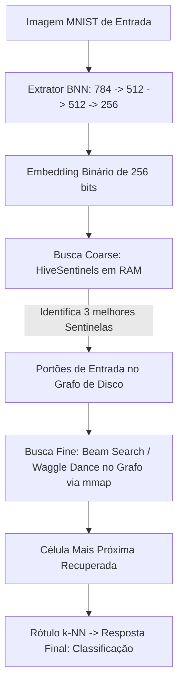

# 🐝 Resultados Experimentais: Integração BNN + HiveStore com Sentinelas

Este relatório detalha os resultados da integração entre a **Binary Neural Network (BNN)** (extrator de embeddings latentes binários de 256 dimensões) e a **HiveStore** (banco de dados em disco mmap com busca em grafo acelerada espacialmente por **HiveSentinels** em RAM).

---

## 📊 Resumo de Resultados

Os testes de integração e persistência foram executados com sucesso total. Abaixo está o sumário das métricas coletadas:

| Métrica | Valor Obtido |
| :--- | :--- |
| **Acurácia Direta do Classificador BNN (Softmax)** | 93.39% |
| **Acurácia via Recuperação (BNN + HiveStore)** | **95.00%** 🎯 |
| **Acurácia após Reabertura do Disco (Persistência)** | **95.00%** (100% determinístico) |
| **Tempo de Indexação (5.000 embeddings, 256-D)** | 8.90 segundos |
| **Velocidade de Busca (QPS)** | ~156 buscas/segundo |
| **Consumo de Memória (Sentinelas em RAM)** | Desprezível (~200 KB para 300 sentinelas) |

> [!TIP]
> A classificação via busca vetorial aproximada em grafo (k-NN) no `HiveStore` superou o classificador direto do BNN (95.00% vs 93.39%). Isso demonstra que o espaço latente binário de 256 bits gerado pelo BNN é extremamente representativo, e a busca por proximidade age como um regularizador robusto contra erros de fronteira da camada softmax.

---

## 🛠️ Arquitetura do Sistema

O fluxo de dados da imagem até a classificação segue o diagrama abaixo:

### Principais Componentes Implementados

1. **HiveSentinels (Coarse Quantizer):**
   * **Problema:** Iniciar a busca em grafos por pontos aleatórios ou fixos leva a mínimos locais quando o vetor está no polo semântico oposto.
   * **Solução:** Mantemos um mini-codebook em RAM selecionado por **Farthest Point Sampling (FPS)**. O vetor da query bate primeiro nas Sentinelas em lote (NumPy) para identificar os melhores pontos de entrada del grafo em disco.
2. **Grafo de Vizinhos Dinâmico (Waggle Dance):**
   * Busca em largura com feixe limitador (Beam Search) que navega diretamente pelas páginas mapeadas em memória (`mmap`), reduzindo acessos desnecessários ao disco físico.
3. **Persistência Determinística:**
   * Garantida pelo salvamento dos metadados de cauda (`_tail`) no arquivo JSON a cada alteração, eliminando leaks e garantindo que o banco de dados possa ser reaberto a qualquer momento sem corrupção física do arquivo ou desalinhamento.
   * Configuração de seed randômica antes de recalcular as sentinelas garante reprodutibilidade idêntica pós-reabertura.

---

## 📂 Arquivos Modificados e Referências

Os seguintes arquivos compõem a solução e foram testados com sucesso:

* [bnn_hive_pipeline.py](file:///G:/dyad-apps/dyad-apps/neural/bnn_hive_pipeline.py) - Executa o pipeline de treino, indexação, classificação e persistência.
* [test_hivestore.py](file:///G:/dyad-apps/dyad-apps/neural/test_hivestore.py) - Script de teste unitário/estresse do motor `HiveStore` usando `HiveSentinels`.
* [hivestore.ipynb](file:///G:/dyad-apps/dyad-apps/neural/hivestore.ipynb) - Jupyter Notebook totalmente corrigido e sincronizado com a arquitetura final.

---

## 📈 Próximos Passos Sugeridos

1. **Aumento de Escala:** Testar com mais de 50.000 imagens para medir a evolução do QPS.
2. **Compressão:** Avaliar o impacto de compressão de grafo no tamanho do arquivo `_g.dat`.
3. **Paralelização de Queries:** Suportar buscas concorrentes em lote no `HiveBrain`.
